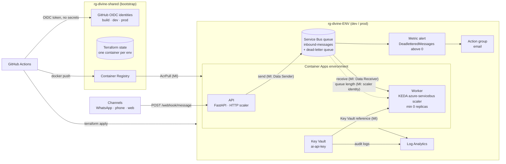

# Divine Tech — AI agent message platform (Azure, scaled-down)

Inbound customer messages (WhatsApp / phone / web) hit a webhook, are queued on
Azure Service Bus and processed by a worker that scales on queue length, down to
zero. Everything is Terraform, deployed by GitHub Actions over OIDC, with **no
secrets in the repo, in GitHub, or in app config**: every hop authenticates with
Microsoft Entra ID (managed identities / workload identity federation).

## Architecture



(Static copy: [docs/architecture.png](docs/architecture.png).)

| Requirement | Implementation |
|---|---|
| API: `POST /webhook/message` → queue, `GET /health` | [`app/api`](app/api) (FastAPI) |
| Worker: consume and log | [`app/worker`](app/worker), structured JSON logs → Log Analytics |
| ACR, Container Apps, Service Bus, Key Vault, Log Analytics | Terraform: [`infra/bootstrap`](infra/bootstrap) (shared) + [`infra/environment`](infra/environment) (per env) + [`infra/modules`](infra/modules) |
| Service Bus via Managed Identity, no connection strings | User-assigned identities + RBAC on the **queue**; `local_auth_enabled = false` on the namespace, so SAS keys cannot be used at all |
| Worker reads `AI_API_KEY` from Key Vault via MI | Container Apps Key Vault reference resolved with the worker identity; RBAC scoped to that **single secret** |
| No secrets in the repo | Nothing to leak: no keys, no connection strings, no client secrets. gitleaks runs on every PR |
| KEDA scaling on queue length, incl. scale to zero | `azure-servicebus` custom scale rule, `minReplicas = 0`, authenticated with a managed identity |
| CI/CD: build + push to ACR, deploy to Container Apps, OIDC | [`.github/workflows`](.github/workflows): `deploy.yml` → `terraform.yml` |
| Alert on DLQ accumulation | [`modules/dlq_alert`](infra/modules/dlq_alert): `DeadletteredMessages` (max) > 0 over 5 min, per queue |
| Bonus: separate dev and prod | Separate resource groups, state containers, tfvars, deployer identities and GitHub environments (prod behind required reviewers) |

## Security model

All permissions are declared in two files: [`infra/bootstrap/github-oidc.tf`](infra/bootstrap/github-oidc.tf)
(pipeline) and [`infra/environment/identities.tf`](infra/environment/identities.tf) (workload).

**Workload identities** (user-assigned, created before the apps so the first revision already works):

| Identity | Role | Scope |
|---|---|---|
| `id-divine-api-<env>` | AcrPull · Azure Service Bus Data Sender | registry · the queue |
| `id-divine-worker-<env>` | AcrPull · Azure Service Bus Data Receiver · Key Vault Secrets User | registry · the queue · the one secret |
| `id-divine-scaler-<env>` | Azure Service Bus Data Owner | the queue |

The KEDA scaler reads queue runtime properties, which needs the *Manage* claim. It gets
its own identity so the application code's identity stays send-only / receive-only.

**Pipeline identities** (GitHub OIDC → federated credentials on user-assigned identities, so
no app registration, no client secret, no Entra ID directory permissions):

| Identity | Trusted subject | Can do |
|---|---|---|
| `id-divine-github-build` | `ref:refs/heads/main` | push images to ACR |
| `id-divine-github-dev` | `environment:dev`, `pull_request` | manage `rg-divine-dev`, its own state container |
| `id-divine-github-prod` | `environment:prod` | manage `rg-divine-prod`, its own state container |

The deployer identities must create role assignments for the workload, but hold
*Role Based Access Control Administrator* with an **ABAC condition** that only allows
assigning the five data-plane roles above. They cannot grant Owner/Contributor to anyone,
including themselves, and the dev identity cannot read prod state.

## Repository layout

```text
app/
  api/            FastAPI webhook -> Service Bus (Dockerfile, non-root)
  worker/         Service Bus consumer -> logs (Dockerfile, non-root)
infra/
  bootstrap/      one-time, local state: tfstate storage, shared ACR, env RGs, GitHub OIDC + RBAC
  environment/    the workload stack, applied per environment (environments/dev.tfvars, prod.tfvars)
  modules/        log_analytics, container_apps_environment, service_bus, key_vault,
                  managed_identity, container_app (azapi), dlq_alert
.github/workflows/
  ci.yml          PR: fmt, validate, gitleaks, docker build, terraform plan (dev)
  deploy.yml      main: build+scan+push once -> apply dev -> (approval) -> apply prod
  terraform.yml   reusable plan/apply/destroy for one environment
  destroy.yml     manual teardown with typed confirmation
scripts/          bootstrap.sh, send-test-messages.sh
```

## Deploy

### Prerequisites

- Azure subscription where you are **Owner** (the bootstrap creates role assignments)
- `az` CLI (logged in), Terraform >= 1.9, `gh` CLI (logged in), a GitHub repo for this code

### 1. Bootstrap (once, from your laptop)

```bash
az login
GITHUB_REPOSITORY=<owner>/<repo> ./scripts/bootstrap.sh
```

This registers the resource providers and applies `infra/bootstrap`. It ends by printing
`gh variable set ...` commands.

### 2. Configure GitHub (once)

Run the printed commands in your clone, set your email for alerts, and protect prod:

```bash
gh variable set ALERT_EMAIL --body "oncall@example.com"
# GitHub > Settings > Environments > prod > Required reviewers
```

Every value is a non-secret identifier (tenant, subscription, client IDs, resource names),
so they are repository **variables**. The repository has zero GitHub secrets.

### 3. Deploy

```bash
git push origin main
```

`deploy.yml` builds both images, scans them with Trivy, pushes `api:<sha>` and `worker:<sha>`
to ACR, applies Terraform to dev (plus a smoke test), then waits for approval and promotes
the **same image tag** to prod.

### 4. Set the real secret value

Terraform creates `ai-api-key` with a placeholder so the worker can reference it from day
one; the real value is set out of band and never touches git or the pipeline:

```bash
KV=$(az keyvault list -g rg-divine-dev --query "[0].name" -o tsv)
az keyvault secret set --vault-name "$KV" --name ai-api-key --value "<real key>"
```

The app references the versionless secret URI, so no Terraform change is needed. Container
Apps refreshes Key Vault references periodically; new replicas (the worker scales from zero)
get the new value, and `az containerapp revision restart` forces it immediately. The worker logs a SHA-256 prefix of the key at startup, so you can confirm the rotation
without ever logging the value.

### Running Terraform locally (optional)

```bash
cd infra/environment
export ARM_SUBSCRIPTION_ID=$(az account show --query id -o tsv)
terraform init \
  -backend-config="resource_group_name=rg-divine-shared" \
  -backend-config="storage_account_name=<TFSTATE_STORAGE_ACCOUNT>" \
  -backend-config="container_name=tfstate-dev" \
  -backend-config="key=environment.tfstate"
terraform plan -var-file=environments/dev.tfvars \
  -var acr_name=<ACR_NAME> -var alert_email=<you> -var image_tag=<existing sha>
```

Commit the generated `.terraform.lock.hcl` files after the first `terraform init`.

## Verify

```bash
API=https://$(az containerapp show -g rg-divine-dev -n ca-divine-api-dev \
      --query properties.configuration.ingress.fqdn -o tsv)

curl "$API/health"
curl -X POST "$API/webhook/message" -H "Content-Type: application/json" \
     -d '{"channel":"whatsapp","from":"+972500000000","text":"hi"}'

# KEDA: burst 200 messages and watch the worker scale out, then back to 0 (~5 min idle)
./scripts/send-test-messages.sh "$API" 200
az containerapp replica list -g rg-divine-dev -n ca-divine-worker-dev -o table

# DLQ alert: a message that always fails is retried 5x, dead-lettered, and the alert emails you
./scripts/send-test-messages.sh "$API" --poison
```

Worker logs in Log Analytics:

```kusto
ContainerAppConsoleLogs_CL
| where ContainerAppName_s == "ca-divine-worker-dev"
| project TimeGenerated, Log_s
| order by TimeGenerated desc
```

## Teardown

```bash
# 1. The workload, per environment (GitHub: Actions > destroy > environment + confirmation)
gh workflow run destroy.yml -f environment=prod -f confirm=prod
gh workflow run destroy.yml -f environment=dev  -f confirm=dev

# 2. The shared layer (state storage, ACR, identities, empty resource groups)
cd infra/bootstrap && terraform destroy -var "github_repository=<owner>/<repo>"
```

Key Vaults are soft-deleted (7 days in dev; prod has purge protection). Names carry a random
suffix, so re-deploying right after a teardown never collides with a soft-deleted vault.

## Design decisions

- **Shared ACR in bootstrap, apps in the environment stack.** The registry is a long-lived
  platform resource; environments are disposable. It also removes the classic chicken-and-egg
  (the app needs an image, the image needs the registry): images are pushed before the first
  `terraform apply`, so Terraform stays the single source of truth for what runs, including the
  image tag, and there is no `ignore_changes` / out-of-band `az containerapp update` drift.
- **Build once, promote the digest.** dev and prod run the exact same `<sha>` image.
- **azapi for Container Apps.** Needed for KEDA scale rules authenticated with a managed
  identity (`scale.rules[].custom.identity`); the alternative is a SAS connection string for the
  scaler, which would require re-enabling local auth on the namespace.
- **User-assigned over system-assigned identities.** They exist before the app, so RBAC can be
  granted (and propagated, see `time_sleep`) before the first revision pulls images or resolves
  the Key Vault reference.
- **Key Vault reference instead of the Key Vault SDK in code.** The platform resolves the secret
  with the managed identity and injects it as an env var; the code has no vault logic. Trade-off:
  a rotated value is picked up on the next refresh/restart, not instantly.
- **Poison-message handling.** Invalid JSON is dead-lettered immediately; processing failures are
  abandoned and retried until `max_delivery_count` (5), then Service Bus moves them to the DLQ,
  which is exactly what the alert watches.

## What I would change in a real production environment

I would put the platform on a private network: a VNet-integrated Container Apps environment
(workload profiles) with Private Endpoints and private DNS for Service Bus (Premium), Key Vault,
ACR (Premium) and state storage, public network access disabled everywhere, and only the API
exposed through Azure Front Door with WAF, request-signature validation for the WhatsApp/telephony
webhooks and rate limiting. Messages would be persisted (Cosmos DB or PostgreSQL with managed
identity auth) and processing made idempotent on `message_id` with Service Bus duplicate
detection, plus sessions if per-conversation ordering matters. Observability would go beyond one
alert: Application Insights with OpenTelemetry tracing from webhook to worker, dashboards and SLO
alerts on end-to-end latency, queue age and error rate, routed to an on-call tool rather than
email. On the delivery side: Terraform state for bootstrap moved to remote state as well, a
read-only plan identity for PRs, policy-as-code (Checkov/Azure Policy) and image signing in CI,
Key Vault write-only secret attributes so not even a placeholder lands in state, revision-based
canary rollouts for the API, and a documented DR posture (zone redundancy, geo-DR pairing for
Service Bus, tested restore of state and data).

## Cost (idle, approximate list prices, West Europe)

| Resource | Per environment / month |
|---|---|
| Service Bus Standard (base) | ~$10 |
| Container Apps (consumption, scale to zero) | ~$0 within the monthly free grant; prod keeps 1 warm API replica ≈ $10–15 |
| Log Analytics | first 5 GB/month free, then ~$2.3/GB (dev capped at 1 GB/day) |
| Key Vault | cents (per 10k operations) |
| Shared: ACR Basic + state storage | ~$5 once, not per environment |

The private-network version above changes the picture mostly through Service Bus Premium
(~$670 per messaging unit / month) and ACR Premium (~$50 / month), which is why it is described
here rather than deployed for this exercise.
